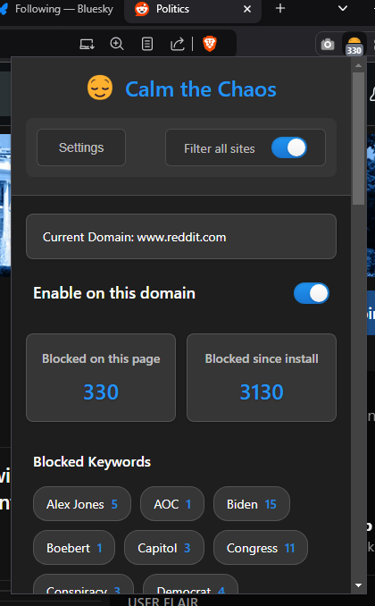
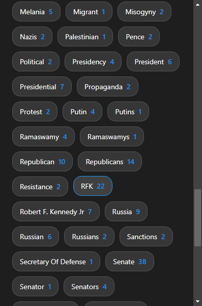

# Calm the Chaos - Preview

## Overview

A [browser extension](https://chromewebstore.google.com/detail/calm-the-chaos/cholkigafekgccbkfgcmcigihipbnjoe) that filters unwanted content related to conflict, violence, and inflammatory rhetoric across every website. This extension, while only in the [Chrome Store](https://chromewebstore.google.com/detail/calm-the-chaos/cholkigafekgccbkfgcmcigihipbnjoe) also works on my favorite browser, [Brave](https://brave.com), Edge and others.

> ⚠️ **Official Preview Release**: This is a preview version (v0.1.0-preview) of Calm the Chaos. Features may be incomplete or subject to change.
>
> By default, content filtering is only enabled for specific platforms (CNN, LinkedIn, Reddit, StackOverflow and YouTube). You can enable filtering for additional domains through the extension settings.

<div align="center">
  <a href="screenshots/popup.png"></a>
  <a href="screenshots/popup2.png"></a>
</div>

### Filtered Categories

The following categories are defined in the [keywords/categories/](keywords/categories/) directory, letting you choose when and how to engage with challenging topics:

| Category | Description |
|----------|-------------|
| Climate and Environment | Terms used in crisis coverage and disaster reporting |
| Economic Policy | Language around economic conflicts, crises, and inequality |
| Education | Terms common in educational controversy and conflict reporting |
| Gun Policy | Terms associated with gun violence and contentious legislation |
| Healthcare and Public Health | Coverage of healthcare crises and system failures |
| Immigration | Terms used in border conflict and immigration controversy |
| International Coverage | Language of international conflicts and diplomatic crises |
| LGBTQ+ | Terms frequently used in contentious legislation and inflammatory coverage |
| Media Personalities | Political commentators and media figures frequently involved in political coverage |
| Military and Defense | Terms related to conflict, weapons, and military threats |
| New Developments | Terms tracking emerging stories and breaking developments |
| Political Organizations | Political parties, movements, and advocacy groups |
| Political Rhetoric | Inflammatory phrases and contentious political language |
| Political Violence and Security Threats | Terms related to violence, extremism, and threats |
| Race Relations | Language used in coverage of racial conflict and discrimination |
| Religion | Terms associated with religious conflict and discrimination |
| Reproductive Health | Language around healthcare restrictions and rights conflicts |
| Social Policy | Terms common in coverage of social crises and system failures |
| US Government Institutions | Federal agencies, positions, and institutional terminology |
| US Political Figures - Full Name | Notable figures in contentious political coverage |
| US Political Figures - Single Name | Common references in controversial coverage |
| Relational Violence | Terms related to violence and abuse |
| Vaccine Policy | Language of vaccine controversy and mandate conflicts |
| World Leaders | International figures in political coverage |

### 🌍 Regional Customization

While the default keywords are US-centric, you can easily maintain your own regional keyword list:

1. Create a plain text file with your keywords (one per line), for example:
   ```
   keyword1
   keyword2
   keyword3
   ```

2. Host this file anywhere on the web (e.g., GitHub Gist, Pastebin)
3. In the extension settings:
   - Go to the "Import/Export" tab
   - Paste your URL in the "Enter URL to import settings" field
   - Click "Import from URL"
4. Enable "Check for new keywords on startup" to automatically update your keywords when you start your browser

## ✨ Features

- **🔍 Customizable Filtering**: Tailor your browsing experience by defining custom keywords and keyword groups.
- **🌐 Platform-Specific Features**:
  - **Reddit**: Filter posts based on keywords while keeping subreddits visible. Optionally enable comment thread filtering with granular control over top-level comments vs replies.
  - **LinkedIn**: Smart filtering of posts and articles while preserving professional networking features.
  - **YouTube**: Content filtering across video titles, descriptions, and comments.
  - **CNN & StackOverflow**: Targeted content filtering while maintaining site functionality.
- **🔄 Flexible Matching**: Choose between exact and flexible matching to refine content identification.
- **🔒 Domain Control**: Enable or disable filtering for specific domains to match your browsing habits.
- **🔗 Updates Section**: The keyword list will be updated every few hours with the newest cast of characters and controversies.

## 🚀 Installation

1. **Clone or Download**: Get this repository on your local machine.
2. **Open Chrome Extensions**: Navigate to `chrome://extensions/`.
3. **Enable Developer Mode**: Toggle the switch in the top right corner.
4. **Load Unpacked**: Click and select the directory where this extension is located.

## 🛠️ Usage

Once installed, the extension works automatically based on your settings. Customize these settings through the `options.html` page, accessible from the extension's icon in the Chrome toolbar.

### Platform-Specific Options

In the extension settings under "Elements" tab:

- **Reddit Comment Filtering**: Toggle "Filter Reddit Comment Threads" to enable/disable comment filtering. When enabled:
  - Top-level comments containing filtered keywords are completely hidden
  - For reply comments, only the filtered comment is hidden while preserving the thread structure
  - Posts are always filtered based on keywords, while subreddits remain visible

## 👩‍💻 Developer Guide

To load the extension in Chrome for development:

1. **Clone or Download the Repository**: Get a local copy of the project on your machine.
2. **Open Chrome Extensions Page**: Navigate to `chrome://extensions/` in your Chrome browser.
3. **Enable Developer Mode**: Toggle the "Developer mode" switch at the top right corner.
4. **Load Unpacked Extension**: Click on the "Load unpacked" button.
5. **Select the Extension Directory**: Browse to the directory where you cloned or downloaded the repository and select it.
6. **Extension Loaded**: The extension should now be loaded into Chrome and ready for testing.

Remember to reload the extension from the extensions page after making changes to see the updates.

#### Ideas

- Develop a configurable scale to adjust the sensitivity of the algorithm in identifying containers to hide. This would allow users to fine-tune the content filtering based on their preferences.

## 🤝 Contributing

Contributions are welcome! If you're a CSS, HTML, or JavaScript expert and can help improve the algorithm for finding containers, I'd love your input. Please feel free to submit a pull request or open an issue with your ideas.

## 📜 License

This project is licensed under the MIT License. See the [LICENSE](LICENSE) file for more details.

## 🤖 Built with AI

I'm a software architect with limited JavaScript expertise. I built this extension primarily using AI tools - specifically Claude.ai's web interface, the Cline VS Code extension, OpenRouter.ai's reseller API service, and Anthropic's direct API. While I can work with JavaScript when needed, I relied heavily on these AI assistants for development.

One way that I optimized costs was to have a Project in Claude solve the problem, then give the output to Cline to do the implementation. I also learned that when debugging, sometimes the session will get in a loop and make worse and worse code. After spending about $1.50 on a problematic bug, I found much better results by having Cline summarize the problem and potential solution, then starting a new session to implement it.

I ended up using OpenRouter when I ran out of Anthropic tokens (their limit is quite low). The total cost was around $300, but that was mainly because I chose the wrong model on OpenRouter (Anthropic/auto?) that didn't have caching, and I was initially feeding it huge files before the refactor.

And really, it's addictive to add new features when it's so easy and fun to use.
