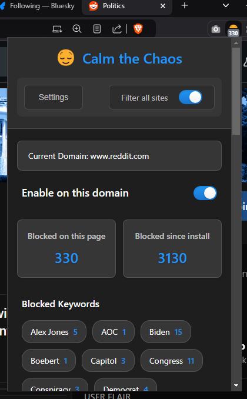
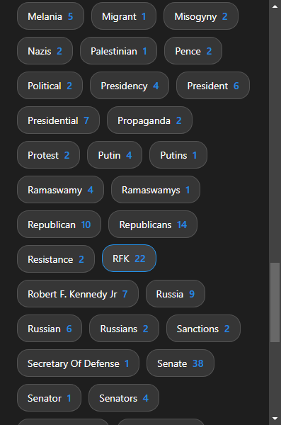

#  Calm the Chaos - Preview

## Overview

A browser extension that filters unwanted content across every website.

> ⚠️ **Official Preview Release**: This is the official preview version (v0.1.0-preview) of Calm the Chaos. Features may be incomplete or subject to change.

<div align="center">
  <a href="screenshots/popup.png"></a>
  <a href="screenshots/popup2.png"></a>
</div>


### Filtered Categories

The extension filters content based on the following categories defined in [keywords.js](scripts/keywords.js):

| Category | Description |
|----------|-------------|
| Education | Topics related to educational policies, practices, and institutions |
| Environment and Climate Change | Topics related to climate change, natural disasters, and environmental issues |
| Financial/Economic | Terms associated with market trends, economic conditions, and financial jargon |
| Gun Rights | Keywords related to gun control, rights, and legislation |
| Immigration | Topics related to immigration policies, practices, and debates |
| International Political Figures | Names of prominent political figures from around the world |
| International Relations | Topics related to global conflicts, diplomacy, and international policies |
| LGBTQ | Keywords related to LGBTQ rights, identities, and issues |
| Media Figures | Names of influential media personalities |
| Other | Miscellaneous keywords covering conspiracy theories, government control, and other controversial topics |
| Political and Government | Keywords related to political ideologies, government policies, and political events |
| Political Ideologies | Terms associated with various political ideologies and movements |
| Race Relations | Topics related to racial equality, justice, and issues |
| Reproductive Health | Keywords related to reproductive rights and health |
| Social Issues | Terms associated with social justice, cultural debates, and societal challenges |
| Technology | Keywords related to tech platforms, digital trends, and online behaviors |
| US Political Figures | Notable political figures in the United States |
| Vaccine Controversies | Keywords related to vaccine debates and controversies |
| Violence and Extremism | Terms related to violent acts, extremism, and security threats |

### 🌍 Regional Customization

While the default keywords are US-centric, you can easily maintain your own regional keyword list:

1. Create a plain text file with your keywords (one per line), for example:
   ```
   keyword1
   keyword2
   keyword3
   ```

2. Host this file anywhere on the web (e.g., GitHub Gist, Pastebin)
3. In the extension settings:
   - Go to the "Import/Export" tab
   - Paste your URL in the "Enter URL to import settings" field
   - Click "Import from URL"
4. Enable "Check for new keywords on startup" to automatically update your keywords when you start your browser

## ✨ Features

- **🔍 Customizable Filtering**: Tailor your browsing experience by defining custom keywords and keyword groups.
- **🌐 Platform Support**: Seamlessly integrates with Reddit, Facebook, Twitter, Instagram, LinkedIn, YouTube, CNN, StackOverflow, and Bluesky.
- **🔄 Flexible Matching**: Choose between exact and flexible matching to refine content identification.
- **🔒 Domain Control**: Enable or disable filtering for specific domains to match your browsing habits.
- **🔗 Updates Section**: The keyword list will be updated every few hours with the newest cast of characters and controversies.

## 🚀 Installation

1. **Clone or Download**: Get this repository on your local machine.
2. **Open Chrome Extensions**: Navigate to `chrome://extensions/`.
3. **Enable Developer Mode**: Toggle the switch in the top right corner.
4. **Load Unpacked**: Click and select the directory where this extension is located.

## 🛠️ Usage

Once installed, the extension works automatically based on your settings. Customize these settings through the `options.html` page, accessible from the extension's icon in the Chrome toolbar.

## 👩‍💻 Developer Guide

To load the extension in Chrome for development:

1. **Clone or Download the Repository**: Get a local copy of the project on your machine.
2. **Open Chrome Extensions Page**: Navigate to `chrome://extensions/` in your Chrome browser.
3. **Enable Developer Mode**: Toggle the "Developer mode" switch at the top right corner.
4. **Load Unpacked Extension**: Click on the "Load unpacked" button.
5. **Select the Extension Directory**: Browse to the directory where you cloned or downloaded the repository and select it.
6. **Extension Loaded**: The extension should now be loaded into Chrome and ready for testing.

Remember to reload the extension from the extensions page after making changes to see the updates.

#### Ideas

- Develop a configurable scale to adjust the sensitivity of the algorithm in identifying containers to hide. This would allow users to fine-tune the content filtering based on their preferences.

## 🤝 Contributing

Contributions are welcome! If you're a CSS, HTML, or JavaScript expert and can help improve the algorithm for finding containers, I'd love your input. Please feel free to submit a pull request or open an issue with your ideas.

## 📜 License

This project is licensed under the MIT License. See the [LICENSE](LICENSE) file for more details.
